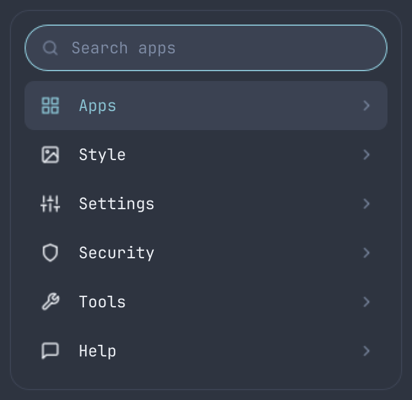
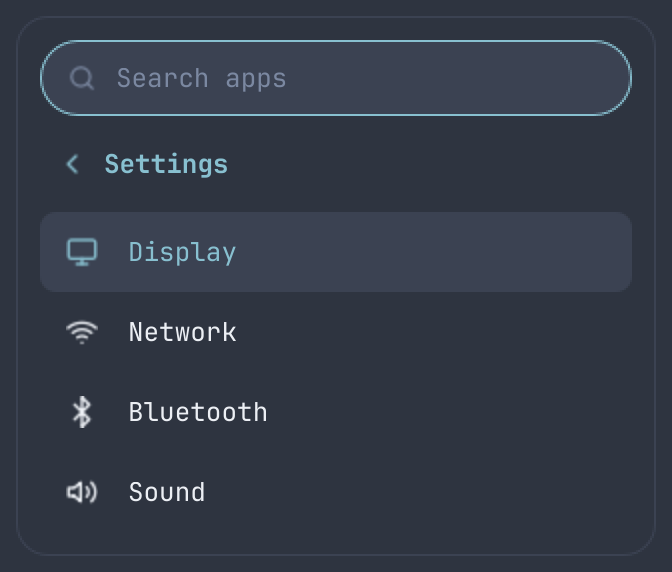
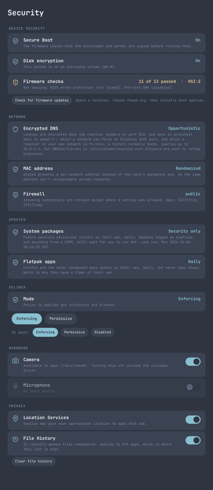
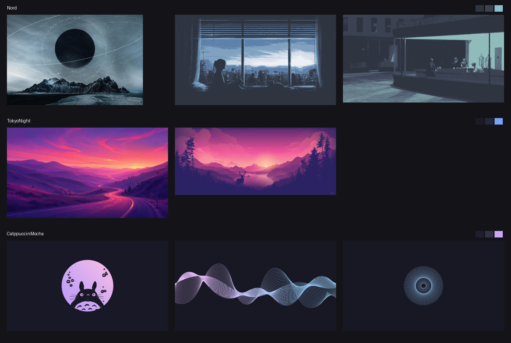
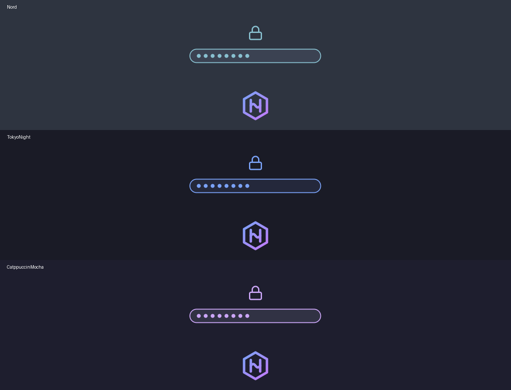

# Hypora

A **privacy-focused Hyprland desktop for Fedora**, installed with a single post-install script on top of a stock Fedora install (no custom ISO). The shell is built on [Quickshell](https://quickshell.org): a custom bar, control center, notification daemon and polkit prompt, all themeable from one palette file.

Privacy here means specific things, not a slogan:

- **Nothing phones home.** No telemetry, no analytics, no update pings of our own.
- **The weather widget never geolocates you.** You pick a city by name; only that name is sent, and until you pick one no weather request is made at all.
- **AI tooling is opt-in.** The installer asks before installing Claude Code, and the default answer is no. Decline, and the menu has no Claude entry at all — nothing advertises it back at you.
- **Your security state is visible and adjustable** — Secure Boot, firmware checks, SELinux, camera, microphone, location and file history all in one window, with each switch saying plainly what it does and does not cover.
- **Flatpak apps come with the tools to audit them:** Flatseal for permissions, Warehouse for what's installed and what data it left behind. Firefox and Spotify run sandboxed rather than as system packages.
- **Everything downloaded is verified.** Each file fetched outside dnf is pinned to a release and checked against a recorded SHA-256; the Hyprland COPR's signing key is checked against a pinned fingerprint before anything installs from it; Claude Code's repository key likewise. HTTPS proves which host answered, not what it sent.
- **The firewall is on, and closed by default.** Fedora's workstation zone leaves ports 1025-65535 open on TCP and UDP; Hypora uses `public`, which allows only ssh, mDNS and DHCPv6, and opens LocalSend's port because that's the one thing here that listens.
- **DNS is encrypted where it can be, and stays yours.** Lookups go through systemd-resolved with DNS-over-TLS in opportunistic mode, so the connection to the resolver is encrypted whenever the resolver supports it. DNS follows the network rather than overriding it, which is what keeps a resolver you run yourself — a Pi-hole, a router — in charge; [Quad9](https://quad9.net) is the fallback when a network provides none. See [DNS](#dns).
- **Your MAC address doesn't follow you between networks.** Wi-Fi scanning is randomized, and each network sees a per-network address instead of the card's permanent serial number. See [MAC addresses](#mac-addresses).
- **Security updates install themselves, and the third-party repo doesn't.** Fedora security advisories apply daily, and so do flatpak updates — which is where the browser lives. The Hyprland COPR is deliberately excluded, so the compositor never changes under you. See [Automatic updates](#automatic-updates).
- **The screen locks on its own.** Ten minutes to lock, fifteen to blank, and it locks before suspending, so waking needs your password.
- **Full-disk encryption is checked, not assumed.** The Security window reports whether this system is on an encrypted volume, and warns about swap that reaches the disk in the clear. Encryption itself has to be chosen when Fedora is installed — see Requirements.
- **Secrets stay out of argv and privileged paths stay out of `$HOME`.** Wi-Fi passwords are handed to `nmcli` on stdin, never as a command-line argument that any process could read from `/proc`; the one helper that runs as root lives in a root-owned directory.

> **Status: early / work in progress.** The desktop shell, installer and SDDM login screen are ready for testing on a fresh install. See [Status](#status).

## Screenshots

All shown in **Nord**; every theme drives the same widgets from its own palette.

**The menu** (`AppMenuPanel.qml`), from the Hypora logo at the top left. Sections on the left, a section opened on the right — Settings lists Hypora's own windows, not the system's control panels.

<p>


</p>

**The theme picker** (`ThemePicker.qml`), **SUPER + ALT + T**. The centred card is the one Enter applies; neighbours sit back and dim. Previews are generated from each theme's `colors.toml`, not screenshots.


**The Security window** (`SecuritySettings.qml`), Menu > Security — shown with the deeper checks already run, so the firmware attributes and the firewall's zone are filled in. What each row reads is in the components table below.



**Included wallpapers**, with each theme's background, surface and accent swatches at the right.



> Shots of the bar and the login screen are still to be added.

## Goals

- An "install it and it just looks good" experience on Fedora, without giving up control of it
- A small, readable codebase: plain shell scripts and QML, no framework on top
- One place to change colors; the Quickshell shell reads everything from the active theme
- Optional AI tooling: Claude Code, offered during install but never assumed

## What you get

**Desktop**
- A minimal SDDM login screen: the time, the date and a password field, in the active theme's colors
- Hyprland, started through `uwsm`
- Quickshell as the shell layer (replaces Waybar, Mako and a standalone polkit agent)

**Quickshell components** (`config/quickshell/`)

| Component | What it does |
|---|---|
| Bar (`Bar.qml`) | Top bar on every monitor: Hypora menu button, that monitor's own workspaces, clock, tray and status icons (network, volume, battery, Do Not Disturb). See [Workspaces and monitors](#workspaces-and-monitors) |
| Menu (`AppMenu.qml`, `AppMenuPanel.qml`) | Menu from the Hypora logo at the top left. Five sections: **Apps**, **Style** (Theme, Next wallpaper), **Settings** (Display, Network, Bluetooth, Sound — Hypora's own windows, not the system's control panels), **Security**, **Tools** (Terminal, region screenshot, and Claude Code only when it's installed) and **Help** (Keybindings). Enter or Right opens a section; Esc or Left goes back; typing searches apps. Power actions are in the control center |
| Security (`SecuritySettings.qml`) | Menu > Security. **Device Security**: whether Secure Boot is on, whether this system is on an encrypted volume (and whether any swap is unencrypted), and fwupd's firmware checks, with **Check for firmware updates** to install any your vendor has published — see [Firmware updates](#firmware-updates). **Opening this window never asks for a password.** The two readings that need root — fwupd's host security attributes and firewalld's zone — sit behind **Run the deeper checks**, which is a single `pkexec hypora-security deep`: one prompt, not one per service. There is no periodic refresh, because re-reading on a timer turned one prompt into one every fifteen seconds.

The shell itself is never run as root, and shouldn't be. Quickshell is a single process — the Security window is not separable from the bar, launcher and notification daemon — and it loads its QML from `~/.config/quickshell/`, which you can write. Privileged code must not sit on a path its own user can edit, which is why `hypora-security` is root-owned in `/usr/local/bin` and reached through pkexec. `hypora-security deep` deliberately re-reads none of your per-user settings, so running it as root can't substitute root's configuration for yours; it reads firewalld's zone from `/etc/firewalld` directly rather than over D-Bus, so that half can't raise a second prompt. **Network**: whether DNS is encrypted (and in which mode, and to which resolver), whether each card is presenting a randomized MAC address, and whether the firewall is running in a closed zone. **Updates**: whether system packages and flatpaks update on their own, and what the package timer is allowed to install. **SELinux**: the running mode and the one set for next boot, switchable between Enforcing and Permissive. **Hardware**: camera (unloads the `uvcvideo` driver) and microphone (mutes it in PipeWire). **Privacy**: location (masks GeoClue) and GTK file history, with a Clear button. Readings and root actions go through `hypora-security`, installed to `/usr/local/bin` and owned by root — pkexec runs it as root, so it must not sit anywhere you could write. Run `hypora-security status` to see exactly what it reads |
| Keyboard shortcuts (`KeybindHelp.qml`) | Menu > Help > Keybindings: every shortcut, grouped, and click one to rebind it — press the new combination and it's saved. Changes go to `~/.config/hypr/keybinds.lua`, which `hyprland.lua` merges over its defaults, then Hyprland reloads. Delete that file (or use **Reset all**) to go back to stock |
| Theme picker (`ThemePicker.qml`) | **SUPER + ALT + T** (or menu > Style > Theme): a full-screen carousel, one theme at a time with its neighbours peeking in. Each card is a live preview — the theme's own wallpaper under a miniature desktop drawn in that theme's colours, plus its palette. Left/Right or scroll to slide, Enter or click to apply, Esc to close; start typing to filter |
| Wallpaper (`Wallpaper.qml`) | Draws the wallpaper on every monitor, cross-fading between images. Each theme has three; cycle with menu > Settings > **Next wallpaper** (or `qs ipc call wallpaper next`). Your choice is remembered |
| Weather (`Weather.qml`) | To the right of the clock: current conditions and a three-day forecast. Pick your city by name — there is no IP geolocation, and nothing is requested until you choose a place. Data from [Open-Meteo](https://open-meteo.com), which needs no account or API key. Your choice lives in `~/.config/hypora/weather.json`; `bin/hypora-weather` does the lookups and can be run on its own |
| Sound (`AudioSettings.qml`) | Menu > Settings > Sound, or the mixer button in the control centre: output and input devices with their own volume and mute, a picker when there's more than one, and a row per application that's playing. Talks to PipeWire through Quickshell — no pavucontrol. `wiremix` is behind "Advanced" for routing and profiles |
| Clipboard (`Clipboard.qml`) | Clipboard history to the left of the clock, also on **SUPER + SHIFT + V**: recent copies, click one to put it back on the clipboard, or Clear to wipe it. Recorded by `wl-paste --watch cliphist store` (started from `hyprland.lua`) — Quickshell can't watch the clipboard itself, as it doesn't speak `wlr-data-control` |
| Clock and calendar (`Clock.qml`, `CalendarPanel.qml`) | Click the clock in the middle of the bar: time, date and a month calendar. Arrows or scrolling change the month; click the month name to jump back to today |
| System usage (`SystemUsage.qml`, `SysInfo.qml`) | Live RAM %, CPU %, CPU temperature and, on machines that report them, GPU usage and GPU temperature — left of the control center. Readings warm to the accent colour and then to red as they climb. Click it to pick which ones appear; the choice is kept in `~/.config/hypora/sysinfo.json`. Numbers come from `bin/hypora-sysinfo` (/proc and /sys, or `nvidia-smi` for NVIDIA) |
| Control center (`ControlCenter.qml`, `ControlPanel.qml`) | Quick settings: click the status icons at the top right. Lock / Log out / Restart / Power off (the last three ask for a second click), volume and brightness sliders, power mode (Saver / Balanced / Performance), and Wi-Fi, Bluetooth, Do Not Disturb and Night Light tiles. The arrows and the mixer button open the TUIs below |
| Network (`NetworkSettings.qml`) | Wi-Fi on/off, nearby networks with signal strength, connect (asking for a password when it's a new secured network), disconnect and forget. No terminal needed |
| Bluetooth (`BluetoothSettings.qml`) | Power and scanning, pair, connect, disconnect and forget, with device battery where reported |
| Display Settings (`DisplaySettings.qml`) | Resolution, refresh rate, scale, rotation, position and on/off per monitor. Changes apply live and revert after 15 seconds unless you keep them; kept settings go to `~/.config/hypr/monitors.lua` |
| Workspaces | Click to switch; highlights the one active on that monitor and dims empty ones |
| Volume (`Volume.qml`) | PipeWire volume icon in the bar. Scroll over it to change the volume |
| Network (`Network.qml`, `Net.qml`) | Wi-Fi (with signal strength) / Ethernet icon from NetworkManager; updates live via `nmcli monitor`. The Wi-Fi tile's arrow opens the Network window |
| Tray (`Tray.qml`) | System tray: left click activates, middle click secondary action, right click menu |
| Battery (`Battery.qml`) | Icon and percentage, laptops only; turns red when low |
| Icons (`Icon.qml`, `Logo.qml`) | Line icons and the Hypora logo, drawn from inline SVG in the theme colors, so no icon font is needed |
| Notifications (`Notifications.qml`) | Quickshell *is* the notification daemon: popups top-right, auto-expire, critical ones persist, action buttons supported |
| Launcher (`Launcher.qml`) | App launcher on **SUPER + R**: type to filter installed apps, Up/Down or Tab to select, Enter to launch, Esc to close. Shows everyday apps only — control panels (anything in the freedesktop `Settings` category, such as qt6ct) live under the menu's Settings section instead |
| Polkit (`PolkitDialog.qml`) | Full-screen authentication prompt (works with `pkexec` and other polkit requests) |

**Terminal tools**

| Tool | For | Opened from |
|---|---|---|
| `nmtui` | Wi-Fi, advanced | Network window > Advanced |
| `bluetoothctl` | Bluetooth, advanced | Bluetooth window > Advanced |
| `wiremix` | Sound, advanced (routing, profiles) | Sound window > Advanced |

Network and Bluetooth have proper Quickshell windows (above). Both ship with Fedora, so nothing extra is downloaded for them.

**Fonts and icons**
- **JetBrainsMono Nerd Font** for monospace and the shell UI, with **Liberation Sans / Serif** for the rest. Set system-wide in `/etc/fonts/conf.d/50-hypora.conf`
- **Papirus-Dark** icons for apps, the launcher and the app menu (GTK settings and gsettings are set to match)

**AI tools**
- **Claude Code**, *optional*: the installer asks, and the default answer is no. Answer ahead of time with `INSTALL_CLAUDE=yes ./install.sh` (or `=no`); a non-interactive run skips it. It comes from Anthropic's signed dnf repository (stable channel; `sudo dnf upgrade claude-code` to update) and needs a paid Claude plan. Run `claude` to log in, and remove it with `sudo dnf remove claude-code && sudo rm /etc/yum.repos.d/claude-code.repo`. The menu's **Tools > Claude Code** entry appears only when the `claude` command is on your `PATH`, so installing or removing it later is reflected after a shell reload
- Nothing else AI-related is installed, and nothing is installed without asking

**Shell, editor and fetch**
- **zsh** with **Oh My Zsh**, tab completion (menu select, case-insensitive), **autosuggestions** and **syntax highlighting**. Set as your login shell; put your own additions in `~/.zshrc.local`, which Hypora never overwrites
- **Neovim** with the **LazyVim** starter. Its colorscheme follows the active Hypora theme (`~/.config/nvim/lua/plugins/hypora.lua` is the only file Hypora owns there)
- **fastfetch** with a Hypora logo and a short readout: OS (shown as *Hypora Linux* with the running kernel), host, CPU, GPU, RAM, WM, terminal, the active theme and the color palette. It greets you in new shells; set `HYPORA_NO_FETCH=1` to turn that off

**Desktop applications**

A handful of GNOME's apps, without the GNOME session — none of them pull `gnome-shell`, `mutter`, `gnome-session` or `gdm`:

| App | Package |
|---|---|
| Files | `nautilus` (with `gvfs` for trash, mounts and network shares) |
| Calculator | `gnome-calculator` |
| Disks | `gnome-disk-utility` |
| Software | `gnome-software` — manages flatpaks; use `dnf` for system packages |

One thing to know: **Nautilus hard-requires `localsearch`**, a background indexer that reads your home directory to make search work. It stays on the machine and talks to nothing over the network, but it is a daemon that reads your files. If you'd rather it didn't run, see what it installed and mask it:

```bash
systemctl --user list-units '*localsearch*'
```

**Why most packages stay native**

Flatpak sandboxing earns its keep for software that handles hostile input, which is why Firefox and Spotify are flatpaks. It does nothing for the rest of this list: the compositor, shell, terminal and portals *are* the session and cannot sandbox themselves; `kitty` and `fastfetch` have no maintained Flathub build at all; the file manager and Disks need the host filesystem and `udisks` to be any use; and tools like `nmap`, `aircrack-ng`, `wireshark` and `virt-manager` need raw sockets, capture privileges or host libvirt, so a sandboxed build would have to be handed the host anyway — paying the integration cost for none of the benefit.

**Virtualization and network tools**
- `@virtualization` (libvirt, QEMU/KVM, virt-manager), with `libvirtd` enabled and your user added to the `libvirt` group
- `nmap`, `aircrack-ng` and `wireshark`/`tshark`, with your user added to the `wireshark` group so captures work without root. Both group changes need a logout to take effect

**Themes**
- Included: **Nord** (default), **Tokyo Night** and **Catppuccin Mocha**
- A theme is one palette, `themes/<Name>/colors.toml`, applied everywhere: the Quickshell shell, kitty, Hyprland window borders, the hyprlock lock screen, GTK 3/4 apps (adw-gtk3 + libadwaita colors), Qt apps (qt6ct) and the SDDM login screen
- Each theme's wallpapers live in `themes/<Name>/backgrounds/` and are copied to `~/.config/hypora/themes/<Name>/backgrounds/`. Drop your own images in either place to add them to the rotation
- Switch any time with the theme picker (**SUPER + ALT + T**) or `hypora-theme TokyoNight` (`hypora-theme` alone lists themes). The shell, borders and terminals change immediately; other open apps pick it up when restarted

## Requirements

- A fresh **Fedora** install (a minimal / Everything netinstall is a good base)
- **Tick "Encrypt my data"** in the installer if you want full-disk encryption. This is the one thing Hypora cannot add for you: LUKS has to be set up as the partitions are created, so switching it on later means reinstalling. The Security window reports which way you went, and flags unencrypted swap — a leak path for memory contents even when the root filesystem is encrypted
- An internet connection and a user with `sudo`
- **Hyprland 0.55 or newer**: the config is written in Lua (`hyprland.lua`), which replaces the deprecated `hyprland.conf` format
- A Quickshell build with the PipeWire, system tray, notifications, UPower and polkit modules. The installer enables COPRs if the packages aren't in the main repos; check that they are current for your Fedora version

## Install

```bash
git clone https://github.com/misfitxtm/Hypora.git ~/.local/share/hypora
cd ~/.local/share/hypora
./install.sh
```

Pick a theme with the `THEME` variable (it must exist under `themes/`). Re-runs keep the theme you last chose with `hypora-theme`:

```bash
THEME=TokyoNight ./install.sh
```

The installer is safe to re-run. It:

1. Checks you're on Fedora and not running as root
2. Enables the `sdegler/hyprland` COPR (Fedora doesn't package Hyprland or uwsm) and checks Hyprland is 0.55+
3. Installs required packages (warns and continues if an optional one is unavailable): PipeWire with wiremix, BlueZ, tuned-ppd for power modes, zsh, Neovim, fastfetch, the `@virtualization` group (libvirt, QEMU/KVM, virt-manager), network and security tools (nmap, aircrack-ng, wireshark/tshark), with nmtui and bluetoothctl as the advanced fallbacks
4. Installs Oh My Zsh and the LazyVim starter, and makes zsh your login shell (an existing `~/.config/nvim` is left alone)
5. Installs JetBrainsMono Nerd Font and sets the system font defaults, then **asks** whether to install Claude Code (default no)
6. Enables NetworkManager, upower, bluetooth and power profiles, points DNS at systemd-resolved with DNS-over-TLS, randomizes MAC addresses, enables `firewalld` in the closed `public` zone, turns on automatic security updates for packages and flatpaks, and sets the default boot target to graphical
7. Installs the theme palettes and templates into `~/.config/hypora/` and applies the chosen theme with `hypora-theme`
8. **Copies** `config/hypr/hyprland.lua`, `config/quickshell/`, the GTK settings and the themes into `~/.config/`, and `applications/*.desktop` (e.g. Display Settings) into `~/.local/share/applications/`
9. Installs the SDDM login theme (colors generated from the chosen theme), disables GDM/LightDM/greetd and enables SDDM, and installs the Plymouth boot theme — the slowest step, because it rebuilds the initramfs
10. Copies the scripts in `bin/` (such as `hypora-theme`) into `~/.local/bin/`

Anything it replaces that you had changed is saved as `<name>.bak.<timestamp>`.

Configs are **copies**, so the clone can be moved or deleted after installing. To update, `git pull` (or clone again) and re-run `./install.sh`. It records a checksum of every file it installs: files you haven't touched are updated quietly, files you edited are saved as `<name>.bak.<timestamp>` before being replaced, and files Hypora no longer ships are removed (unless you edited them). Quickshell live-reloads when you edit `~/.config/quickshell/*.qml`.

### Starting the desktop

Reboot. SDDM shows the Hypora login screen and starts the **Hyprland (uwsm-managed)** session. On machines with more than one user, the name appears above the box; click it or press Up/Down to switch.

Without the login screen, start it from a text console (TTY) with `uwsm start hyprland-uwsm.desktop` (or `start-hyprland`). Quickshell starts from the `hyprland.start` hook in `hyprland.lua` either way.

## Keybindings

| Keys | Action |
|---|---|
| SUPER + Enter | Terminal |
| SUPER + B | Browser (Firefox, sandboxed as a flatpak) |
| SUPER + E | Files (Nautilus) |
| SUPER + R | App launcher |
| SUPER + A | Hypora menu |
| SUPER + ALT + T | Theme picker |
| SUPER + SHIFT + V | Clipboard history |
| SUPER + SHIFT + S | Screenshot a region |
| SUPER + L | Lock (also locks on its own after 10 minutes) |
| SUPER + M | Log out |
| SUPER + Q | Close window |
| SUPER + V | Toggle floating |
| SUPER + F | Fullscreen |
| SUPER + J | Toggle split |
| SUPER + P | Pseudo-tile |
| SUPER + S / SUPER + ALT + S | Show scratchpad / move window to it |
| SUPER + arrows | Move focus |
| SUPER + SHIFT + left / right | Send the focused window to the next monitor over |
| SUPER + 1-0 / SUPER + SHIFT + 1-0 | Switch to / move window to workspace, on the monitor you're using |
| SUPER + scroll | Cycle this monitor's workspaces |
| SUPER + drag (left / right mouse) | Move / resize window |
| Volume / brightness / media keys | As labelled on the keyboard |

The programs behind these are set at the top of `config/hypr/hyprland.lua` (`terminal`, `browser`, `fileManager`). Every shortcut above can be rebound from **menu > Help > Keybindings**.

These follow Hyprland's own defaults wherever Hypora doesn't need the key. One deliberate difference: Hyprland puts *move window to scratchpad* on SUPER + SHIFT + S, which Hypora gives to the screenshot, so that moves to **SUPER + ALT + S**.

## Usage and testing

```bash
qs                          # run Quickshell manually to see QML errors in the terminal
notify-send "Test" "Hello"  # test notifications
pkexec true                 # test the polkit prompt
qs ipc call launcher toggle # open the launcher without the keybind
qs ipc call menu toggle     # open the app menu
qs ipc call display open    # open Display Settings
```

Don't run another notification daemon (Mako, dunst, swaync) or polkit agent alongside Quickshell. They will conflict with it.

## Repository layout

```
.
├── install.sh              # main installer
├── config/                 # copied into ~/.config
│   ├── hypr/hyprland.lua, hypridle.conf
│   ├── quickshell/         # shell.qml, Bar, ControlCenter, Tray, Volume, Network,
│   │                       # Battery, Notifications, PolkitDialog, Launcher, ControlPanel, Tile,
│   │                       # AppMenu, AppMenuPanel, Apps, Dropdown, DisplaySettings, Logo,
│   │                       # Clock, CalendarPanel, ThemePicker, Wallpaper,
│   │                       # SystemUsage, SysInfo, NetworkSettings, BluetoothSettings,
│   │                       # KeybindHelp, Clipboard, SecuritySettings, Weather,
│   │                       # Icon, Net, ShellState, Slider, PowerButton
│   ├── kitty/kitty.conf    # terminal (colors come from the theme)
│   ├── zsh/zshrc           # -> ~/.zshrc
│   ├── fastfetch/          # config.jsonc and the hypora.txt ASCII logo
│   ├── nvim/               # the one LazyVim plugin file Hypora owns
│   └── uwsm/env            # session environment (Qt apps use qt6ct)
├── bin/
│   ├── hypora-theme        # applies a theme everywhere
│   ├── hypora-sysinfo      # prints RAM/CPU/GPU stats as JSON for the bar widget
│   ├── hypora-screenshot   # region / window / screen, saved and copied
│   ├── hypora-console      # puts the theme's colours on the text console (kernel args)
│   ├── hypora-firmware     # checks LVFS and installs firmware updates, in a terminal
│   ├── hypora-plymouth     # draws the boot screen's images in the current palette
│   ├── hypora-security     # security status as JSON, and the root actions behind it
│   │                       # (installed root-owned to /usr/local/bin, not ~/.local/bin)
│   └── hypora-weather      # place search and forecast via Open-Meteo
├── docs/images/            # the screenshots used in this readme
├── applications/           # .desktop entries copied into ~/.local/share/applications
├── themes/
│   ├── Nord/colors.toml    # palette (UI, terminal ANSI colors, GTK/icon theme)
│   ├── TokyoNight/colors.toml
│   ├── CatppuccinMocha/colors.toml
│   └── templates/          # one per app; {{ key }} is filled from colors.toml
│                           # (includes plymouth.plymouth.tpl, the boot screen)
├── system/
│   ├── fontconfig/         # system font defaults -> /etc/fonts/conf.d/
│   ├── yum.repos.d/        # Claude Code repository -> /etc/yum.repos.d/
│   ├── systemd/            # resolved.conf.d/ -> /etc/systemd/resolved.conf.d/ (DNS)
│   │                       # system/ -> /etc/systemd/system/ (flatpak update timer)
│   ├── NetworkManager/     # conf.d/ -> /etc/NetworkManager/conf.d/
│   │                       # (systemd-resolved, MAC randomization)
│   ├── dnf/automatic.conf  # -> /etc/dnf/ (automatic security updates)
│   └── sddm/               # login screen, installed by install.sh
│       ├── 10-hypora.conf  # -> /etc/sddm.conf.d/ (Wayland greeter on Hyprland, hypora theme)
│       ├── hyprland.lua    # minimal Hyprland session that hosts the greeter
│       └── hypora/         # SDDM theme -> /usr/share/sddm/themes/hypora/
└── LICENSE
```

Not created yet: `packages/` and `install/` (see [Status](#status)).

## Customizing

- **Colors and font:** edit `themes/<Name>/colors.toml`, or copy a theme folder to `themes/<NewName>/`, re-run `./install.sh`, then `hypora-theme <NewName>`. To theme another app, add a template to `themes/templates/` and link its output in `bin/hypora-theme`
- **Terminal and TUIs launched by widgets:** `terminal`, `mixer`, `network` and `bluetooth` in `themes/templates/Theme.qml.tpl`
- **Autostart, keybinds:** `config/hypr/hyprland.lua`
- **Apps that should float instead of tile:** add the Wayland app ID to the `floatingApps` list near the window rules in `config/hypr/hyprland.lua` (Calculator is there already). `hyprctl clients` prints the ID as `class` for any window you have open
- **Monitors:** Display Settings, or edit `~/.config/hypr/monitors.lua` (loaded by `hyprland.lua`)
- **Workspaces per monitor:** `WS_STATIC` and `WS_STRIDE` at the top of the workspace section in `config/hypr/hyprland.lua` (see [Workspaces and monitors](#workspaces-and-monitors))
- **Bar contents:** `Bar.qml` (the right-hand `Row` holds the tray and the control center button)
- **Control center:** `ControlPanel.qml` (tiles are `Tile {}` items in the `GridLayout`)
- **Menu sections:** the `pages` list in `AppMenuPanel.qml`
- **Security:** menu > Security; anything needing root asks through the polkit prompt
- **Boot screen:** `themes/templates/plymouth.plymouth.tpl` for layout, `bin/hypora-plymouth` for the images (see [Boot screen](#boot-screen))
- **Text console colours:** `sudo hypora-console apply` (see [Text console](#text-console))
- **DNS resolver:** `system/systemd/resolved.conf.d/hypora-dns.conf`, then re-run `./install.sh` (see [DNS](#dns))
- **MAC randomization:** `system/NetworkManager/conf.d/hypora-mac.conf`, or per network with `nmcli connection modify` (see [MAC addresses](#mac-addresses))
- **What updates on its own:** `system/dnf/automatic.conf` (see [Automatic updates](#automatic-updates))
- **Keybinds:** menu > Help > Keybindings, or the `keys` table at the top of the keybindings section in `config/hypr/hyprland.lua`
- **Shell:** `~/.zshrc.local` for your own zsh settings; `config/zsh/zshrc` for Hypora's
- **fetch readout:** `config/fastfetch/config.jsonc`, with the logo in `hypora.txt`
- **System usage readings:** click the widget in the bar, or edit `~/.config/hypora/sysinfo.json`

## Firmware updates

**Menu > Security > Check for firmware updates** opens a floating, pinned terminal running `bin/hypora-firmware`, which refreshes from the [Linux Vendor Firmware Service](https://fwupd.org) and installs whatever applies to the machine:

```
fwupdmgr refresh --force
fwupdmgr get-updates --no-unreported-check
fwupdmgr update -y --no-reboot-check
```

This is a button rather than part of the automatic updates on purpose. Firmware is written to the hardware itself, some of it only takes effect after a restart, and a motherboard update interrupted half way is how machines get bricked — so it happens when you ask, in a window you can watch. fwupd asks polkit before touching any device, so Hypora's password prompt appears before anything is written.

The window is `float` + `pin` so it stays in front and remains visible if you change workspace mid-update. It's matched on its title, and the Security window passes `--title` when launching the terminal: Hyprland decides float and pin at the moment a window is **mapped**, so a title the program sets afterwards arrives too late and the window ends up tiled. The script prints the title escape sequence too, which covers running `hypora-firmware` yourself in a terminal started without the flag. This assumes a terminal that accepts `--title` — kitty, alacritty and foot all do.

Two things worth knowing:

- **Checking contacts fwupd.org.** It's the one part of Hypora that reaches an outside server without you typing something first, which is why it isn't done in the background. Devices whose vendors don't publish to LVFS never appear — those update from the vendor's own tool or the UEFI setup screen.
- **"No updates" is a success, not a failure.** `fwupdmgr` exits 2 for "ran fine, nothing to do" and 3 for "not found". The script treats both as success; reading them as errors is what would make a fully-updated machine look broken.

## Workspaces and monitors

Every monitor has its own independent set of workspaces. Workspace 1 exists on each screen at the same time, SUPER + 1 switches the monitor you're pointing at, and sending a window to the other screen leaves it on the workspace you sent it to rather than dropping it wherever that screen happened to be.

**Five per monitor are permanent**, so they're always there to switch to and the bar can always show them. **Numbers 6 to 0 are made when you first use them** and disappear again once they're empty.

Hyprland numbers workspaces globally — a workspace belongs to one monitor at a time — so a per-monitor set is built by giving each monitor a block of ten numbers:

| monitor | permanent | on demand |
|---|---|---|
| 0 | 1–5 | 6–10 |
| 1 | 11–15 | 16–20 |
| 2 | 21–25 | 26–30 |

Every number in a block is pinned to its monitor with a `hl.workspace_rule`, and the first five of each are `persistent`. The bar subtracts the block's base before drawing, which is why each screen shows its own `1 2 3 4 5`. To change how many: `WS_STATIC` and `WS_STRIDE` at the top of the workspace section in `config/hypr/hyprland.lua` — keep `WS_STRIDE` at least as large as the number of keys you bind, or two monitors' blocks will overlap.

The workspace keybinds are Lua functions rather than plain dispatchers, because the target depends on which monitor has focus when you press them. Two things that caused this to be written carefully, both worth knowing if you edit it:

- `hl.get_active_monitor()` is only meaningful **inside** the callback. Called while the config is being read it returns nil, and it is never re-evaluated ([#14878](https://github.com/hyprwm/Hyprland/discussions/14878)).
- `hl.dsp.*` builds an object and does nothing on its own; it has to be handed to `hl.dispatch()`. Returning it from a bind callback silently does nothing ([#14282](https://github.com/hyprwm/Hyprland/discussions/14282)).

The rules are applied from the `hyprland.start` hook rather than at the top level, because `hl.get_monitors()` is still empty while the config is being read, and again on `monitor.added` so a screen plugged in later gets its own set.

## Boot screen



The boot splash and the **LUKS passphrase prompt** are the same screen: `systemd-cryptsetup` asks through `systemd-ask-password`, and Plymouth draws it. So theming the unlock prompt means shipping a Plymouth theme, which Hypora generates from the active palette like everything else.

Two halves:

- `themes/templates/plymouth.plymouth.tpl` → `/usr/share/plymouth/themes/hypora/hypora.plymouth`. It uses `two-step`, the module Fedora's own themes are built on, and takes the background and progress-bar colours straight from the palette.
- `bin/hypora-plymouth` draws `entry.png`, `bullet.png`, `lock.png`, `capslock.png` and `watermark.png` in the palette's colours. Everything the module doesn't colour itself is a PNG, so the images have to be generated per theme. It uses signed distance fields and the standard library only — no Pillow, no ImageMagick — because this has to work on a machine mid-install.

The padlock is the same geometry as the shell's `lock` icon, and the watermark is the same hexagon mark as the bar and the login screen. The mark keeps its own gradient in every palette, matching `Logo.qml`.

**Don't put Plymouth's own key names in the comments.** `plymouth-set-default-theme` and `plymouth-populate-initrd` read this file with unanchored greps and expand the result unquoted, so a comment containing `ModuleName=` matches alongside the real line. The value becomes two lines, `[ ! -e $VALUE.so ]` fails with *"too many arguments"*, and — because that failure makes the guarding `if` false rather than true — the module is then installed under a mangled path and **never reaches the initramfs**, leaving a boot screen that silently falls back to text. `ModuleName` and `ImageDir` have no guard at all; `Font`, `TitleFont` and `MonospaceFont` take the first match, so a comment above the real line shadows it. The installer checks for this and refuses to switch themes rather than leaving you with a text prompt.

**It lives in the initramfs.** Plymouth runs before the root filesystem is mounted, so the theme is copied into the initramfs by dracut. That has two consequences:

- Switching themes updates `/usr/share/plymouth/themes/hypora/` but **not** what renders at boot until `sudo dracut -f`. `hypora-theme` prints this rather than running it, because a dracut rebuild takes 20–30 seconds and needs root — too much to do silently behind a theme switch.
- The font is handled for you: `plymouth-populate-initrd` runs `fc-match` on the `Font=` line and copies the matching file in. JetBrainsMono Nerd Font is installed to `/usr/local/share/fonts`, system-wide, so root's fontconfig finds it.

**What can't be themed.** `two-step` has no key for the prompt text's colour — it always draws it white. Fine for the three dark palettes here; a light palette would need the `script` module instead (`plymouth-plugin-script`), which replaces the ini with a real script at the cost of debugging failures in early boot.

Preview it without rebooting, which is worth doing before trusting it on an encrypted disk:

```bash
sudo plymouthd --debug --tty=/dev/tty2 ; sudo plymouth --show-splash
sudo plymouth ask-for-password          # the prompt, on tty2
sudo plymouth quit
```

If the theme ever fails to render on a machine that needs a passphrase, **Esc** drops Plymouth to the plain text prompt. The installer also refuses to switch to the theme unless `entry.png` and `bullet.png` are actually on disk, so a half-generated theme can't lock you out.

## Text console

The boot screen above is Plymouth drawing on a graphics device. When there isn't one — a VM with no KMS, a GPU whose driver loads after the initramfs asks for your passphrase, or any boot where you press Esc — Plymouth falls back to its text module and you get a plain console instead.

That fallback can't be themed through Plymouth: `text.plymouth` has no colour settings and the module hard-codes them. What *can* be changed is the Linux virtual terminal's own 16-colour palette, which is a kernel parameter:

```bash
hypora-console print      # the arguments for the current theme
hypora-console status     # what the running kernel is using
sudo hypora-console apply # set them; takes effect at the next boot
sudo hypora-console remove
```

It has to be a kernel argument rather than a config file because the palette is set when the console initialises — before the initramfs asks for a passphrase. Anything that waits for a service to start is already too late.

Slot 0 is the console background and slot 7 the foreground, so those take the theme's `background` and `foreground` rather than its black and white; the other fourteen are the palette's ANSI colours. `apply` writes through `grubby` **and** `/etc/kernel/cmdline` — updating only the boot entries is how the colours quietly vanish one kernel update later, since new kernels take their command line from that file.

Two things it deliberately doesn't do: it isn't run by `hypora-theme` on every theme switch (editing the kernel command line shouldn't be a side effect of picking a colour scheme — `hypora-theme` just prints a reminder when the console is out of step), and it leaves the cursor alone. Add `vt.global_cursor_default=0` yourself if you'd rather not have the blinking block.

Related knobs this doesn't touch: the console font is `FONT=` in `/etc/vconsole.conf` (`terminus-fonts-console` provides `ter-v22n` and similar), and `loglevel=3` next to `quiet` stops kernel messages scrolling the passphrase prompt away.

## DNS

Plain DNS is the one part of browsing that stays readable to whoever runs the network, long after HTTPS covered everything else: the domain of every site you open, visible to the café router, your ISP and anyone in between, and rewritable by all of them.

Two things fix that, and they pull in opposite directions: encrypting the connection to the resolver, and choosing which resolver you trust. Hypora resolves the tension in favour of **a resolver you control**:

```ini
# /etc/systemd/resolved.conf.d/hypora-dns.conf
FallbackDNS=9.9.9.9#dns.quad9.net 149.112.112.112#dns.quad9.net 2620:fe::fe#dns.quad9.net 2620:fe::9#dns.quad9.net
DNSOverTLS=opportunistic
DNSSEC=allow-downgrade
Cache=yes
```

- **DNS follows the network.** Whatever resolver DHCP hands out is the one used. That's what keeps a Pi-hole, a router or an internal DNS server in charge, with its filtering and its local names intact. `FallbackDNS=` only applies when a network hands out no resolver at all.
- **`DNSOverTLS=opportunistic`** encrypts the connection when the resolver answers on port 853 and uses plain DNS when it doesn't. A Pi-hole on port 53 needs that fallback. The cost is that a network can force plaintext by blocking 853, so this stops someone passively watching, not the network operator itself.
- A second file, `/etc/NetworkManager/conf.d/hypora-dns.conf`, tells NetworkManager to hand its DNS to resolved rather than writing `/etc/resolv.conf` directly — without it, none of the above is consulted.

Check it:

```bash
resolvectl status          # the resolver in use, and DNSOverTLS under Global
resolvectl query github.com
```

### Pinning one resolver

To send every lookup to one resolver regardless of what the network says, set both `DNS=` and `Domains=~.`. The second line is the one that matters: without it resolved keeps using the DHCP servers for most queries and a `DNS=` line does close to nothing.

For a Pi-hole at a static address — worth doing, because it makes routing deterministic instead of depending on what DHCP said:

```ini
DNS=10.0.0.2
Domains=~.
```

For encrypted DNS on untrusted Wi-Fi, strictly, with no plaintext fallback:

```ini
DNS=9.9.9.9#dns.quad9.net 2620:fe::fe#dns.quad9.net
Domains=~.
DNSOverTLS=yes
```

The `#dns.quad9.net` suffix is what makes that encrypted DNS rather than DNS to an encrypted-looking address: it's the name the resolver's certificate has to match. Cloudflare is `1.1.1.1#one.one.one.one`, Mullvad `194.242.2.2#dns.mullvad.net`. Edit the file (or `system/systemd/resolved.conf.d/hypora-dns.conf` and re-run the installer) and `sudo systemctl restart systemd-resolved`.

Note that `DNSOverTLS=yes` breaks captive portals — hotel and airport sign-in pages need DNS to load and block DNS until you've used them. For a one-off, without editing anything:

```bash
sudo resolvectl dnsovertls <interface> opportunistic   # e.g. wlan0; sign in
sudo resolvectl dnsovertls <interface> yes             # then put it back
```

One more knob: `Cache=yes` makes repeat lookups instant, at the cost of hiding them from the resolver, so a Pi-hole's dashboard will undercount. `Cache=no` shows it everything.

## MAC addresses

A network card's permanent MAC address is a unique serial number it broadcasts, unencrypted, at every network it touches. Left alone it's a tracking identifier with no cookie to clear: the same laptop is recognisable across every café, airport and shop it passes, by anyone listening.

`/etc/NetworkManager/conf.d/hypora-mac.conf` randomizes two separate things:

```ini
[device-mac-randomization]
wifi.scan-rand-mac-address=yes

[connection-mac-randomization]
wifi.cloned-mac-address=stable
ethernet.cloned-mac-address=stable
```

**Scanning** is the probe requests a Wi-Fi card broadcasts while looking for networks — constantly, whether or not you ever connect. This is the leak that follows you around a building. NetworkManager already defaults it to on; it's set explicitly so a future change of that default doesn't quietly turn it off.

**Connections** use `stable`, not `random`: one address per connection profile, the same every time you join that network, different for every other network. That defeats cross-network tracking while leaving the things a changing MAC breaks — DHCP reservations, captive portal sessions, router rules keyed to a device — working, because each network still sees one consistent address. `random` is stronger and breaks all of those; `permanent` is the card's real address.

Two consequences worth knowing:

- **The address changes once**, when this first takes effect, so existing DHCP reservations need updating to the new one. To exempt a network instead and keep the real address: `nmcli connection modify "<name>" wifi.cloned-mac-address permanent`.
- **`stable` is derived from the connection profile and `/etc/machine-id`.** Delete and recreate the profile and the address changes again.

Check it:

```bash
nmcli -f GENERAL.HWADDR,GENERAL.PERM-HWADDR device show wlan0
```

When the two differ, it's working. Menu > Security reports the same thing, and flags a card that's on a network using its permanent address.

## Automatic updates

Nothing covers both halves of this system, so there are two timers.

**System packages** go through `dnf5-automatic.timer` (daily at 06:00, up to an hour of jitter, catching up on missed runs), configured in `/etc/dnf/automatic.conf`. Both timers are enabled but not started by the installer, so they begin at the reboot it ends with:

```ini
[commands]
apply_updates = yes
download_updates = yes
upgrade_type = security
reboot = never
```

`upgrade_type = security` limits unattended installs to packages carrying a Fedora security advisory, which has two consequences:

- **It excludes the Hyprland COPR.** Third-party repositories publish no advisory metadata, so nothing from them can ever match — meaning the compositor this desktop depends on never updates while you're using it. COPR updates stay a decision you make by running `sudo dnf upgrade` yourself.
- **It also excludes real fixes** that Fedora shipped as a bugfix or enhancement update rather than a security one, which happens often enough to matter. This narrows the window on the worst holes; it is not a substitute for updating.

`reboot = never`, because a desktop deciding on its own to restart is worse than a kernel that waits. `dnf5 needs-restarting -r` says when a reboot is due.

**Flatpak apps** — including Firefox, where most of the day-to-day risk actually lives — are invisible to dnf, so `hypora-flatpak-update.timer` runs `flatpak update --system` daily at 07:00. Old runtimes aren't cleaned up automatically; `flatpak uninstall --unused` does that, or Warehouse.

Check both:

```bash
systemctl list-timers 'dnf*' 'hypora*'
journalctl -u dnf5-automatic -u hypora-flatpak-update
sudo systemctl start hypora-flatpak-update.service   # run the flatpak one now
sudo dnf5 automatic --no-installupdates              # see what the package one would do
```

To go back to updating by hand, `sudo systemctl disable --now dnf5-automatic.timer hypora-flatpak-update.timer`. To install everything rather than security advisories only, set `upgrade_type = default` in `system/dnf/automatic.conf` and re-run the installer — understanding that this includes the COPR.

## Status

Working:
- Installer for packages, services, theme and config links
- Quickshell bar, app menu, control center, display settings, tray, volume, network, battery, notifications and polkit prompt
- Hyprland Lua config with keybinds, Nord-style borders and Quickshell autostart
- SDDM login screen (exercised on a bare-metal boot)

In progress / planned:
- Package lists in `packages/*.txt` and a modular `install/` directory

## Known limitations

- Most development happened in a VM. It has since been installed and booted on bare metal, where encrypted DNS was confirmed to route as intended, but hardware-specific pieces (GPU, laptop battery and backlight) have had far less exercise than the rest
- The Hyprland Lua config format is new; if something misbehaves after a Hyprland update, check `hyprctl configerrors` and the Hyprland wiki
- Hyprland comes from the third-party `sdegler/hyprland` COPR, so builds may lag behind or break after Fedora updates
- In a VM with no Wi-Fi or Bluetooth adapter, the Network and Bluetooth windows say so plainly rather than looking broken
- NetworkManager keeps Fedora's own Wi-Fi backend. An earlier version switched it to iwd so that `impala` would work; both are gone, and re-running the installer puts a machine that took that switch back on the stock configuration
- Don't add a `qmldir` to `config/quickshell/`: it hides every component not listed in it (`Bar is not a type`). Quickshell finds `Theme.qml` on its own via `pragma Singleton`
- `~/.config/quickshell/Theme.qml`, `~/.config/kitty/current-theme.conf`, `~/.config/hypr/theme.lua`, `hyprlock.conf`, the GTK `gtk.css`/`settings.ini` and `qt6ct.conf` are links to files `hypora-theme` generates; edit the palette or templates instead, or your changes are lost on the next theme switch
- DNS-over-TLS is opportunistic, not strict, so a network that blocks port 853 silently gets plaintext queries. Strict mode is a two-line change but breaks captive portals — see [DNS](#dns)
- MAC randomization changes each card's address once, which breaks existing DHCP reservations until they're updated — see [MAC addresses](#mac-addresses)
- Automatic updates only install packages Fedora tagged as security advisories, which misses fixes shipped as bugfix updates. Run `sudo dnf upgrade` periodically anyway
- Fedora versions tested: Fedora 44

## Reporting bugs

**Please file bugs and feature requests as [GitHub issues](https://github.com/misfitxtm/Hypora/issues).** That's the only place they're tracked.

What makes a report useful here:

- Which Fedora version, and whether it's bare metal or a VM
- The output of `hyprctl configerrors` if it's a compositor or keybind problem
- The output of `qs` run from a terminal if it's a shell problem — QML errors print there and nowhere else
- `hypora-security status` for anything in the Security window
- `journalctl -b -u <unit>` for a service that didn't start

## License

See [LICENSE](LICENSE).

## A note on AI assistance

The code here was written and reviewed by me, with help from [Claude Code](https://claude.com/claude-code). I decide what gets built and why, read every change before it lands, and test it on real hardware.

Either way, read the code rather than trust it. This is a desktop that configures your firewall, your DNS, your firmware updates and a helper that runs as root; the installer is plain shell and the shell layer is plain QML, both commented to explain *why* rather than *what*, specifically so that reading them is practical.
